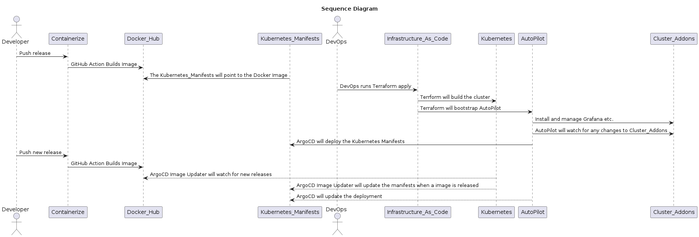

# devops-extreme-automation-guide

## Description

This repo serves as a guide to fully (well, as close to fully as possible) automate building and deploying your microservices.
It shows how to combine some great open source tools in a seperation of concerns manner.

This is a list of the most commonly used components involved in building and deploying apps along with links to external
repos as examples.  If you piece these compoents together you can let automation do most of the heavy lifting when it comes 
to devops automation.

## Component Parts

+ [Containerize](https://github.com/polinchw/devops-extreme-automation-guide#containerize)
+ [Kubernetes Manifests](https://github.com/polinchw/devops-extreme-automation-guide#kubernetes-manifests)
+ [GitOps](https://github.com/polinchw/devops-extreme-automation-guide#gitops)
    + [AutoPilot](https://github.com/polinchw/devops-extreme-automation-guide#autopilot)
+ [Infrastructure as Code](https://github.com/polinchw/devops-extreme-automation-guide#infrastructure-as-code)

### Containerize

Starting with your app you'll want to package it in a way that makes it easy to deploy as a container.  This [hello-github-webhook](https://github.com/polinchw/hello-github-webhook) is a very basic python app that uses Github Actions to build and push a Docker image to Docker Hub.

### Kubernetes Manifests

After the example hello-github-webhook app is containerized we'll want to tell Kubernetes how to deploy it.  We want to place the Kubernetes manifests into a seperate git repository as a best practice to set ourselves up for the next building block of our automation (GitOps).  This [hello-github-webhook-cd](https://github.com/polinchw/hello-github-webhook-cd) repo will tell Kubernetes how to deploy the [hello-github-webhook](https://github.com/polinchw/hello-github-webhook) app.  

### GitOps

GitOps is a strategy of deploying apps to Kubernetes by using Git as the source of truth as to what is deployed.  I'll be using [ArgoCD](https://argo-cd.readthedocs.io/en/stable/) as my GitOps solution to deploy the hello-github-webhook app to my Kubernetes cluster.  I'll also be using ArgoCD's ApplicationSet to deploy a bunch of cluster add-on apps like Grafana, Cert-Manager, and Prometheus to my cluster.  

Once ArgoCD installed on the cluster it will be in charge of deploying the apps and keeping them in sync
with what is in the [hello-github-webhook-cd](https://github.com/polinchw/hello-github-webhook-cd) repository.

#### AutoPilot

ArgoCD can be installed manually if you like, there are lots of examples on how to do that.  If you want to up your 
ArgoCD game and have it automatically install itself along with the apps you want ArgoCD to manage you can do that with 
ArgoCD AutoPilot.  This [auto-pilot](https://github.com/polinchw/auto-pilot) repo will install the hello-github-webhook-cd 
manifests along with the Helm charts defined in this [cluster-addons](https://github.com/polinchw/cluster-addons) repo.

### Infrastructure as Code

There are about 100 different ways to create a Kubernetes cluster.  I've used Kubespray, RKE, individual cloud providers' 
uis to name a few.  For this example I've choosen [Terraform](https://www.terraform.io/).  The main reason I choose Terraform is you can tell it to create 
a Kubernetes cluster and do post install actions against that cluster, like boot strap ArgoCD AutoPilot.  I saw combining Terraform with AutoPilot as the holy grail to automating everything with on Terraform command.  This [terraform](https://github.com/polinchw/terraform) repo shows you how to create a Kubernetes cluster on Azure AKS.  It builds the cluster, installs ArgoCD Autopilot which will deploy the [hello-github-webhook-cd](https://github.com/polinchw/hello-github-webhook-cd) manifests as an ArgoCD mananged app.

## Diagram(s)

